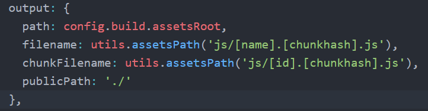

# questionnaire

vue2.0 + vue-router2.0 + vuex2.0 + vue-cli + webpack

## Build Setup

``` bash
# install dependencies
npm install

# serve with hot reload at localhost:8080
npm run dev

# build for production with minification
npm run build
```

# webpack
* 安装：```npm install webpack -g```
* 修改webpack配置输出目录：

    

# eslint
* 修改indent, 缩进为4个空格：

    ``` javascript
    'indent':[1, 4, {"SwitchCase":1}]
    ```

# vue-router
* 配置路由

    ```
    javascript
    // main.js中配置路由
    import VueRouter from 'vue-router'
    Vue.use(VueRouter)
    const router = new VueRouter({
        routes: [
            {path: '/', name: 'home', component: componentName},
            {path: '/user:id', name: 'user', component: User} //动态路径参数
        ]
    })
    new Vue({
        el: '#app',
        router,
        template: '<App/>',
        components: { App }
    })

    // 模板中路由跳转
    <router-link to="/">首页</router-link>
    <router-link to="{name: home}">首页</router-link> //使用命名路由跳转
    <router-link to="{name: user, params: {id: 123}}">用户</router-link> //跳转到/user/123

    // 在js中跳转
    this.$router.push('/')
    this.$router.push({name: 'home'})
    this.$router.push({name: 'user', params: {id: 123}}) //跳转到/user/123
    ```

# vue2.0
* 列表循环：

    ```
    javascript
    //在文本中使用使用{{}}插值法，在元素属性中使用时，用v-bind
    <li v-for="(item, index) in list" :id="'li' + index">{{item}}</li>
    ```

* modal遮罩层组件，表示是否显示遮罩层的modalShow布尔值变量在父组件中设置和控制，modal中显示的文字message在子组件中使用props从父组件中传过来，确定和取消按钮的点击事件使用自定义从父组件传到
    ```
    javascript
    //使用Modal组件
    <Modal v-if="modalShow" message="确定删除问卷？" @confirm-event="confirmHandler" @hide-event="modalShow = false"></Modal>
    //Modal组件中
    props: ['message'],
    methods: {
        confirm () {
            this.$emit('confirm-event')
        },
        hide () {
            this.$emit('hide-event')
        }
    }
    ```

* 有个问题尚需解决，在实现全选和反选时发现input的click事件比v-model晚一步，比如说一组复选框如下：
    ```
    javascript
    <div id="app">
        <input type="checkbox" id="jack" value="Jack" @click="checkbox" v-model="checkedNames">
        <label for="jack">Jack</label>
        <input type="checkbox" id="john" value="John" @click="checkbox" v-model="checkedNames">
        <label for="john">John</label>
        <input type="checkbox" id="mike" value="Mike" @click="checkbox" v-model="checkedNames">
        <label for="mike">Mike</label>
        <br>
        <span>Checked names: {{ checkedNames }}</span>
    </div>
    <script>
    new Vue({
        el: '#app',
        data: {
            checkedNames: []
        },
        methods: {
            checkbox () {
                console.log(this.checkedNames)
            }
        }
    })
    </script>
    ```
当点击第一个复选框时，checkedNames已经变成["Jack"],但是控制台中输出的还是[]。所以在实现全选和复选的功能时没能用到v-model的作用，所以代码看起来很挫。。。
